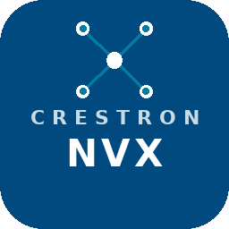

# Crestron DM NVX for Home Assistant

Local control and monitoring of Crestron DM NVX AV-over-IP transmitters and
receivers through their authenticated CresNext REST API. No cloud service is
required. This is a Home Assistant **custom integration**, not a Supervisor
add-on or a Crestron Home driver.

**Requires Home Assistant 2024.12 or newer**, device authentication enabled,
and HTTPS access to each NVX device on port 443.

[Install with HACS](https://my.home-assistant.io/redirect/hacs_repository/?owner=Phant0mElit3&repository=ha-dm-nvx&category=integration)
 | [Latest release](https://github.com/Phant0mElit3/ha-dm-nvx/releases/latest)
 | [Installation guide](INSTALLATION.md)
 | [Report a problem](https://github.com/Phant0mElit3/ha-dm-nvx/issues/new/choose)

## Install

1. In HACS, open **Custom repositories** from the menu.
2. Add `https://github.com/Phant0mElit3/ha-dm-nvx` with type **Integration**.
3. Download **Crestron DM NVX** and restart Home Assistant.
4. Open **Settings > Devices & services > Add integration**, then search for
   **Crestron DM NVX**.
5. Enter a name, IP address or hostname, and the device's admin credentials.
   Repeat for each device; its transmitter/receiver role is detected.

[Add the integration](https://my.home-assistant.io/redirect/config_flow_start/?domain=crestron_nvx)
after installation and restart. For a manual install, extract the release ZIP
into your Home Assistant configuration directory so the files land in
`custom_components/crestron_nvx/`.

This repository is installed as a HACS custom repository; passing validation
does not mean it is listed in the default HACS catalog.

## Controls and Status

| Feature | Availability |
| --- | --- |
| HDMI signal/sink, resolution, frame rate and HDCP status | Transmitters and receivers; first HDMI port |
| Ethernet connectivity and network status | Primary network adapter |
| Video stream source and full route Off | Receivers |
| Independent audio source and audio-only Off | Receivers with Audio Follows Video disabled |
| Audio Follows Video switch | Receivers exposing the route-control property |
| HDMI output enable/blank | Receivers exposing output-disable status |
| Stream/local HDMI selection | Receivers with HDMI inputs |
| HDMI input selection | Multi-input transmitters |
| Test pattern selection | Devices listing supported patterns |
| OSD messages and restored display duration | Devices exposing OSD |
| JPEG preview camera | Supported devices; opt-in in Options |
| CEC power/volume/mute events | Transmitter HDMI input 1 |
| Identify LED flashing | Devices exposing Identify |
| Redacted diagnostics | Each configured device |

A video source change writes only `VideoSource`. Audio and USB follow according
to the device's own follow settings. Selecting video **Off** clears video,
audio and USB together. Audio **Off** clears only audio.

Duplicate stream names are disambiguated with their IDs. An undiscovered
current route appears as `Unknown (<ID>)` until its source is discovered.

## Configuration and Recovery

Use **Configure/Options** to adjust the polling interval (10-300 seconds,
default 30) and enable the preview camera. Preview requests use the device's
JPEG generator and can add load.

Use the entry menu's **Reconfigure** action to change its address or
credentials. Existing entity identifiers and automations are retained when the
device's serial number matches. A different physical device must be added as
a new entry. Devices without a known serial number must reconnect at their
original address before an address change can be verified.

Expired sessions renew automatically. An unreachable device becomes
unavailable and retries; rejected credentials prompt for reauthentication.
Commands report rejected writes to Home Assistant and refresh device state.
Some firmware applies HDMI output/OSD changes after a short delay; the next
poll confirms the actual state.

## Automations

See [configuration_example.yaml](configuration_example.yaml) for source
routing, CEC volume/mute, signal-loss alerts, OSD messages and a dashboard.

CEC is an **event entity**: trigger on its state timestamp changing and inspect
the `event_type` attribute. It does not fire an event-bus event named after its
entity ID. The examples ignore startup/unavailable transitions.

For Apple TV remote commands, configure the source to send HDMI-CEC volume
commands rather than IR or Bluetooth-only commands. The integration listens
passively; it does not transmit CEC commands.

## Compatibility and Scope

The project's existing hardware notes cover **DM-NVX-E30, DM-NVX-352,
DM-NVX-350 and DM-NVX-D30**, firmware **7.1.5259.00090**. Other models and
firmware may expose different properties. Optional controls are detected from
responses, not assumed from the product name.

The 2.2.0 maintenance changes are covered by automated tests with mocked
device responses; they have not yet been revalidated on physical NVX hardware.
CI tests the minimum supported Home Assistant release and the latest release.
The earlier advertised 2023.8 minimum was incorrect for APIs already in use.

This integration covers the AV workflows above, not every Crestron REST
object. Device firmware updates, reboot/reset, network/security configuration,
USB pairing, serial/IR transmission, EDID management, Dante and multiview layout
management are not exposed. Status/CEC coverage is currently limited to the
first HDMI port; input selection can still select other reported inputs.

## Documentation and Support

- [Installation and troubleshooting](INSTALLATION.md)
- [API behavior and hardware notes](API_DOCUMENTATION.md)
- [Examples](configuration_example.yaml)
- [Changelog](CHANGELOG.md)
- [Contributing and testing](CONTRIBUTING.md)
- [Repository structure](STRUCTURE.md)
- [Official Crestron API reference](https://sdkcon78221.crestron.com/sdk/DM_NVX_REST_API/Content/Topics/API-Reference.htm)

For a bug report, include Home Assistant/integration versions, NVX model,
firmware, role and relevant logs. Download diagnostics from the integration
entry and review them before posting. Do not post device credentials.

## Trademark Notice

This independent integration is not affiliated with, endorsed by, sponsored
by, or supported by Crestron Electronics, Inc. Crestron, DM NVX and related
marks belong to their respective owners. The MIT license applies to original
integration code and does not grant rights to third-party trademarks or assets.
See [LICENSE](LICENSE) and [NOTICE](NOTICE).
